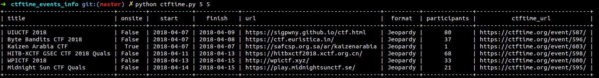

# CTF time event api checker

- Very simple tool to call the CTF Time API Events information (past and upcoming)
- https://ctftime.org/api/v1/events/?limit={number}&start={timestamp}&finish={timestamp}
- limit is fixed to 100 results max in the script

- Usage :
```
python ctftime.py [start] [end]
```
- `start` (optional): number of days before now (default : 0)
- `end`   (optional): number of days after now (default: 10)

- Exemple (launched on 16/04/2018) :
